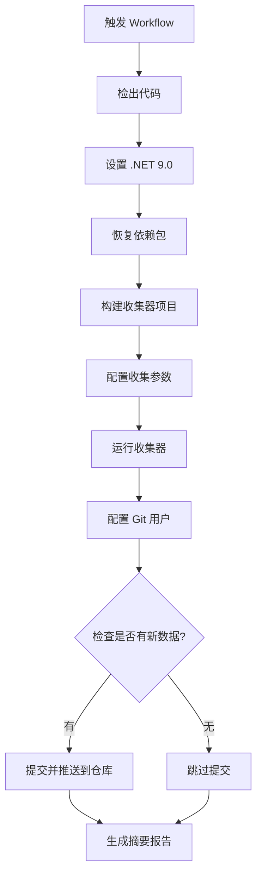
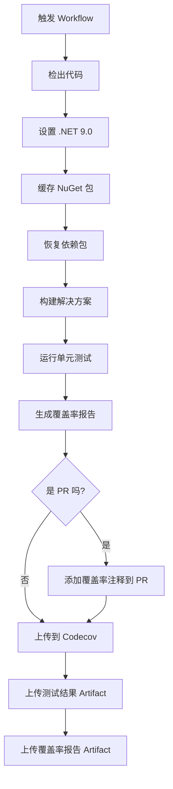

# GitHub Actions 工作流说明

本项目使用 GitHub Actions 实现自动化构建、测试和壁纸数据收集。

---

## 📋 工作流概览

本项目包含两个主要的 GitHub Actions 工作流：

| 工作流                | 文件名                   | 用途                         | 运行环境       |
| --------------------- | ------------------------ | ---------------------------- | -------------- |
| 🌅 Collect Wallpapers | `collect-wallpapers.yml` | 自动收集必应壁纸元数据       | Ubuntu Latest  |
| 🔨 Build and Test     | `build-and-test.yml`     | 构建项目并运行单元测试       | Windows Latest |

---

## 🌅 Workflow 1: Collect Bing Wallpapers

### 功能说明

自动收集全球 14 个国家/地区的必应每日壁纸元数据，并将数据以 JSON 格式存储到 `archive/` 目录。

### 触发方式

#### 1. 自动触发（定时任务）

Workflow 会在以下时间自动运行：

| 时区    | UTC 时间 | 本地时间             | 说明                 |
| ------- | -------- | -------------------- | -------------------- |
| 🌏 亚洲 | 22:00    | 北京时间 06:00       | 收集亚洲地区当日壁纸 |
| 🌍 欧洲 | 06:00    | 中欧时间 07:00/08:00 | 收集欧洲地区当日壁纸 |
| 🌎 美洲 | 14:00    | 美东时间 09:00/10:00 | 收集美洲地区当日壁纸 |

**默认配置**：

-   收集天数：1 天（仅当天）
-   分辨率：FullHD (1920×1080)
-   收集范围：所有 14 个国家/地区

#### 2. 手动触发

1. 访问 GitHub 仓库的 [**Actions**](https://github.com/hippiezhou/BingWallpaperGallery/actions) 页面
2. 选择 **"Collect Bing Wallpapers"** workflow
3. 点击 **"Run workflow"** 按钮
4. 配置可选参数：
    - **收集天数** (`collect_days`)：1-8 天（默认：1）
    - **分辨率** (`resolution_code`)：Standard / FullHD / HD / UHD4K（默认：FullHD）
    - **收集所有国家** (`collect_all_countries`)：true / false（默认：true）
5. 点击 **"Run workflow"** 执行

### 执行流程



### 关键步骤详解

#### 步骤 1: 设置 .NET 环境

```yaml
- name: 设置 .NET 9.0
  uses: actions/setup-dotnet@v4
  with:
      dotnet-version: "9.0.x"
```

#### 步骤 2: 动态配置收集参数

使用 `jq` 工具动态修改 `appsettings.json`：

```bash
jq --arg days "$COLLECT_DAYS" \
   --arg resolution "$RESOLUTION_CODE" \
   --argjson collectAll "$COLLECT_ALL" \
   '.CollectionOptions.CollectDays = ($days | tonumber) |
    .CollectionOptions.ResolutionCode = $resolution |
    .CollectionOptions.CollectAllCountries = $collectAll |
    .CollectionOptions.MaxConcurrentRequests = 3 |
    .CollectionOptions.PrettyJsonFormat = true' \
   src/BingWallpaperGallery.Collector/appsettings.json > temp.json
```

#### 步骤 3: 运行收集器

```bash
dotnet run --project src/BingWallpaperGallery.Collector/BingWallpaperGallery.Collector.csproj --configuration Release
```

**输出位置**：`archive/{Country}/{Date}.json`

#### 步骤 4: 智能提交

```bash
# 检查是否有新文件
git status --porcelain

# 仅在有变更时提交
if [ -n "$(git status --porcelain)" ]; then
  git add archive/
  git commit -m "🌅 自动收集 ${DATE} 的 Bing 壁纸信息"
  git push
fi
```

**特点**：

-   ✅ 自动检测新数据
-   ✅ 无变更时跳过提交
-   ✅ 详细的提交信息（包含日期、文件数、时间）

### 输出示例

#### 成功收集的摘要报告

```markdown
## 📊 Bing 壁纸收集摘要

**执行时间:** 2025-10-16 06:00 UTC
**收集天数:** 1 天
**分辨率:** FullHD

✅ **状态:** 成功收集到新的壁纸信息

## 📈 数据统计

| 国家/地区    | JSON 文件数 |
| ------------ | ----------- |
| China        | 9           |
| UnitedStates | 9           |
| Japan        | 9           |
| Germany      | 9           |
| ...          | ...         |

**总文件数:** 126

---

_⏰ 定时执行时间: 每天 UTC 22:00 (亚洲) / 06:00 (欧洲) / 14:00 (美洲)_
_💡 支持手动触发，可自定义收集参数_
```

### 权限要求

```yaml
permissions:
    contents: write # 需要写权限以提交和推送数据
    actions: read # 需要读权限以访问工作流信息
```

---

## 🔨 Workflow 2: Build and Test

### 功能说明

自动构建项目、运行单元测试、生成代码覆盖率报告，并上传到 Codecov。

### 触发方式

-   ✅ **Push 事件**：所有分支的推送都会触发
-   ✅ **Pull Request 事件**：所有分支的 PR 都会触发
-   ✅ **手动触发**：支持通过 `workflow_dispatch` 手动执行

### 环境变量

```yaml
env:
    DOTNET_VERSION: "9.0.x" # .NET SDK 版本
    SOLUTION_PATH: "BingWallpaperGallery.sln" # 解决方案路径
    BUILD_PLATFORM: "x64" # 构建平台
```

### 执行流程



### 关键步骤详解

#### 步骤 1: 缓存 NuGet 包

使用 GitHub Actions 缓存加速构建：

```yaml
- name: Cache NuGet packages
  uses: actions/cache@v4
  with:
      path: ~/.nuget/packages
      key: ${{ runner.os }}-nuget-${{ hashFiles('**/Directory.Packages.props') }}
      restore-keys: |
          ${{ runner.os }}-nuget-
```

**优点**：

-   加速后续构建
-   基于 `Directory.Packages.props` 文件的哈希值缓存

#### 步骤 2: 构建解决方案

```bash
dotnet build BingWallpaperGallery.sln \
  --configuration Release \
  --no-restore \
  -p:Platform=x64
```

#### 步骤 3: 运行测试并收集覆盖率

```bash
dotnet test src/BingWallpaperGallery.Core.Tests/BingWallpaperGallery.Core.Tests.csproj \
  --configuration Release \
  --verbosity normal \
  --collect:"XPlat Code Coverage" \
  --results-directory ./coverage
```

#### 步骤 4: 生成覆盖率报告

使用 `ReportGenerator` 生成多种格式的报告：

```yaml
- name: Generate coverage report
  uses: danielpalme/ReportGenerator-GitHub-Action@5.3.11
  with:
      reports: "coverage/**/coverage.cobertura.xml"
      targetdir: "coveragereport"
      reporttypes: "HtmlInline;Cobertura;MarkdownSummaryGithub"
      assemblyfilters: "-xunit*;-*.Tests"
```

**报告类型**：

-   `HtmlInline`：HTML 格式的详细报告
-   `Cobertura`：Codecov 使用的格式
-   `MarkdownSummaryGithub`：用于 PR 注释的 Markdown 格式

#### 步骤 5: PR 覆盖率注释

如果是 Pull Request，自动添加覆盖率注释：

```yaml
- name: Add coverage comment to PR
  if: github.event_name == 'pull_request'
  uses: marocchino/sticky-pull-request-comment@v2
  with:
      recreate: true
      path: coveragereport/SummaryGithub.md
```

#### 步骤 6: 上传到 Codecov

```yaml
- name: Upload coverage to Codecov
  uses: codecov/codecov-action@v4
  with:
      files: ./coverage/**/coverage.cobertura.xml
      flags: unittests
      name: codecov-umbrella
      fail_ci_if_error: false
      token: ${{ secrets.CODECOV_TOKEN }}
```

### Artifacts 输出

工作流会生成以下 artifacts：

| Artifact 名称     | 内容                      | 保留时间 |
| ----------------- | ------------------------- | -------- |
| `test-results`    | 测试结果和覆盖率原始数据  | 90 天    |
| `coverage-report` | HTML 格式的覆盖率详细报告 | 90 天    |

---

## 🔍 配置文件映射

### Collect Wallpapers 参数映射

| Workflow 参数           | appsettings.json 字段                     | 说明             | 默认值 |
| ----------------------- | ----------------------------------------- | ---------------- | ------ |
| `collect_days`          | `CollectionOptions.CollectDays`           | 收集天数 (1-8)   | 1      |
| `resolution_code`       | `CollectionOptions.ResolutionCode`        | API 分辨率       | FullHD |
| `collect_all_countries` | `CollectionOptions.CollectAllCountries`   | 是否收集所有国家 | true   |
| 固定值                  | `CollectionOptions.MaxConcurrentRequests` | 并发请求数       | 3      |
| 固定值                  | `CollectionOptions.PrettyJsonFormat`      | JSON 格式美化    | true   |

### Build and Test 环境变量

| 环境变量         | 说明             | 值                       |
| ---------------- | ---------------- | ------------------------ |
| `DOTNET_VERSION` | .NET SDK 版本    | 9.0.x                    |
| `SOLUTION_PATH`  | 解决方案文件路径 | BingWallpaperGallery.sln |
| `BUILD_PLATFORM` | 构建平台架构     | x64                      |

---

## 🛠️ 故障排查

### Collect Wallpapers 常见问题

#### 问题 1: 构建失败

**可能原因**：

-   .NET 9.0 SDK 未正确安装
-   项目文件路径错误
-   依赖包恢复失败

**解决方案**：

-   检查 `setup-dotnet` 步骤是否成功
-   确认项目路径：`src/BingWallpaperGallery.Collector/BingWallpaperGallery.Collector.csproj`
-   查看 workflow 日志中的详细错误信息

#### 问题 2: 未收集到新数据

**可能原因**：

-   当天壁纸已经收集过
-   必应 API 暂无更新
-   网络连接问题

**解决方案**：

-   查看 workflow 日志中的 API 响应
-   检查必应 API 是否可访问
-   尝试手动触发并调整参数（如增加收集天数）

#### 问题 3: Git 推送失败

**可能原因**：

-   `GITHUB_TOKEN` 权限不足
-   仓库保护规则限制
-   分支保护规则冲突

**解决方案**：

-   确认 workflow 有 `contents: write` 权限
-   检查仓库设置 → Branches → 保护规则
-   确保 Actions 有权限推送到主分支

### Build and Test 常见问题

#### 问题 1: 测试失败

**可能原因**：

-   代码变更导致测试用例失败
-   测试环境配置问题
-   依赖项版本不兼容

**解决方案**：

-   查看测试日志中的具体错误信息
-   本地运行 `dotnet test` 复现问题
-   检查测试项目的依赖配置

#### 问题 2: 覆盖率上传失败

**可能原因**：

-   `CODECOV_TOKEN` 未配置或已过期
-   覆盖率文件格式不正确
-   Codecov 服务暂时不可用

**解决方案**：

-   检查仓库 Secrets 中的 `CODECOV_TOKEN`
-   验证覆盖率文件路径：`coverage/**/coverage.cobertura.xml`
-   查看 Codecov 官方状态页面

#### 问题 3: NuGet 缓存失效

**可能原因**：

-   `Directory.Packages.props` 文件变更
-   缓存键冲突
-   GitHub Actions 缓存过期

**解决方案**：

-   缓存会在 `Directory.Packages.props` 变更时自动失效
-   可以手动清除仓库的 Actions 缓存
-   等待缓存自动过期（7 天）

---

## 🎯 最佳实践

### 1. 壁纸收集工作流

#### 定时任务配置

-   ✅ 保持 3 个时区的定时触发，确保全球覆盖
-   ✅ 收集天数设置为 1，避免重复数据
-   ✅ 使用 FullHD 分辨率平衡质量和性能

#### 手动触发场景

-   🔹 **初次运行**：设置 `collect_days=8` 收集历史数据
-   🔹 **补充数据**：设置 `collect_all_countries=false` 单独收集某个国家
-   🔹 **测试功能**：使用不同参数验证收集器功能

#### 监控建议

-   📊 定期检查 Actions 运行状态
-   📈 关注 `archive/` 目录文件增长趋势
-   📝 查看摘要报告统计数据

### 2. 构建测试工作流

#### 代码质量保障

-   ✅ 确保所有测试通过后才合并 PR
-   ✅ 保持代码覆盖率在 80% 以上
-   ✅ 定期查看覆盖率趋势

#### PR 审查

-   🔹 查看 PR 中的覆盖率注释
-   🔹 关注新增代码的测试覆盖率
-   🔹 确认 Codecov 检查通过

#### 性能优化

-   ⚡ 利用 NuGet 包缓存减少构建时间
-   ⚡ 仅运行必要的测试项目
-   ⚡ 使用 `--no-restore` 跳过已还原的依赖

---

## 📚 相关文档

-   [BingWallpaperGallery.Collector 功能说明](../src/BingWallpaperGallery.Collector/README.md)
-   [快速开始指南](../docs/QuickStart.md)
-   [隐私策略](../PRIVACY_POLICY.md)
-   [GitHub Actions 官方文档](https://docs.github.com/en/actions)
-   [Cron 表达式参考](https://crontab.guru/)
-   [Codecov 文档](https://docs.codecov.com/)
-   [ReportGenerator 文档](https://github.com/danielpalme/ReportGenerator)

---

## 📊 工作流状态

查看实时状态：

-   🌅 **壁纸收集**：[](https://github.com/hippiezhou/BingWallpaperGallery/actions/workflows/collect-wallpapers.yml)
-   🔨 **构建测试**：[](https://github.com/hippiezhou/BingWallpaperGallery/actions/workflows/build-and-test.yml)

---

**最后更新时间**: 2025-10-16
